# Data Warehouse com dbt, Docker e Airflow

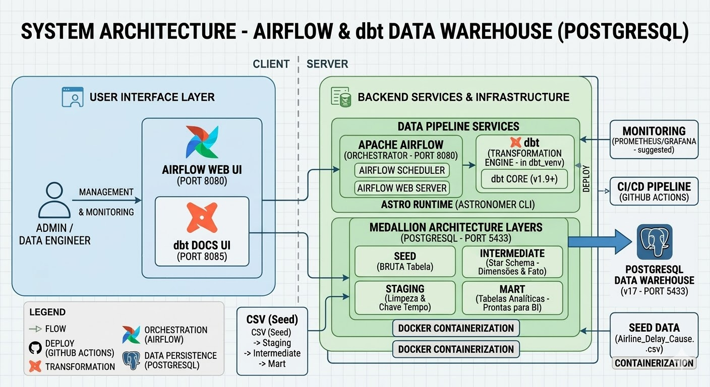

> Documentação completa para replicação do projeto. Siga cada passo na ordem indicada.

---

## Sumário

1. [Visão Geral do Projeto](#1-visão-geral-do-projeto)
2. [Arquitetura e Tecnologias](#2-arquitetura-e-tecnologias)
3. [Estrutura de Pastas](#3-estrutura-de-pastas)
4. [Pipeline de Dados](#4-pipeline-de-dados)
5. [Pré-requisitos](#5-pré-requisitos)
6. [Passo a Passo — Parte 1: Ambiente Local](#6-passo-a-passo--parte-1-ambiente-local)
7. [Passo a Passo — Parte 2: Data Warehouse com dbt](#7-passo-a-passo--parte-2-data-warehouse-com-dbt)
8. [Passo a Passo — Parte 3: Orquestração com Airflow](#8-passo-a-passo--parte-3-orquestração-com-airflow)
9. [Modelos dbt em Detalhe](#9-modelos-dbt-em-detalhe)
10. [Configurações Importantes](#10-configurações-importantes)
11. [Erros Comuns e Soluções](#11-erros-comuns-e-soluções)
12. [Comandos de Referência Rápida](#12-comandos-de-referência-rápida)
13. [CI/CD com GitHub Actions](#13-cicd-com-github-actions)

---

## 1. Visão Geral do Projeto

Este projeto implementa um **Data Warehouse (DW) completo** do zero, usando uma stack moderna de engenharia de dados. O domínio de dados escolhido é a análise de **atrasos em voos comerciais nos EUA**, com cerca de 318 mil registros reais.

### Objetivos:

- Subir um banco de dados PostgreSQL com Docker
- Organizar transformações de dados em camadas com dbt (Medallion Architecture)
- Criar dimensões e fatos (Star Schema)
- Usar pacotes dbt (`dbt-utils`, `dbt-expectations`, `dbt-date`)
- Orquestrar o pipeline com Apache Airflow usando a biblioteca `astronomer-cosmos`
- Gerenciar ambientes `dev` e `prod` de forma profissional
- Automatizar validações com CI/CD via GitHub Actions

---

## 2. Arquitetura e Tecnologias

### Stack Tecnológica

| Tecnologia | Versão | Função |
|---|---|---|
| **PostgreSQL** | 17 | Banco de dados relacional (via Docker) |
| **dbt** | 1.9+ | Transformação e modelagem de dados |
| **Apache Airflow** | 3.x (Astro Runtime) | Orquestração e agendamento |
| **Docker** | Qualquer recente | Containerização dos serviços |
| **Python** | 3.11 | Linguagem base |
| **UV** | Qualquer recente | Gerenciador de pacotes e virtualenv Python |
| **astronomer-cosmos** | Qualquer recente | Integração dbt + Airflow |

### Pacotes dbt

| Pacote | Versão | Para que serve |
|---|---|---|
| `dbt-utils` | 1.3.0 | Macros utilitárias (surrogate_key, unpivot, etc.) |
| `dbt-expectations` | 0.10.8 | Testes avançados de qualidade de dados |
| `dbt-date` | 0.17.0 | Utilitários de data/hora (fuso: America/Sao_Paulo) |

### Arquitetura Medallion (camadas do dbt)

```
CSV (Seed)
    └── Staging        → limpeza e padronização dos dados brutos
         └── Intermediate → dimensões e fato (Star Schema)
              └── Mart     → tabelas analíticas prontas para BI
```

---

## 3. Estrutura de Pastas

```
projeto_final_engenharia/
│
├── .github/
│   └── workflows/
│       └── ci.yml                    # Pipeline de CI/CD com GitHub Actions
│
├── 1_local_setup/                    # Configuração do ambiente local
│   ├── .env                          # Variáveis de ambiente (usuário/senha do banco)
│   ├── docker-compose.yml            # Define o container PostgreSQL
│   ├── pyproject.toml                # Dependências Python do projeto
│   └── .python-version               # Versão do Python usada
│
├── 2_data_warehouse/
│   └── dw_bootcamp/                  # Projeto dbt
│       ├── dbt_project.yml           # Configuração principal do dbt
│       ├── packages.yml              # Pacotes dbt externos
│       ├── profiles.yml              # Conexão com o banco (criado manualmente, não commitado)
│       ├── seeds/
│       │   └── Airline_Delay_Cause.csv  # Dados reais de atrasos (~41 MB, 318k linhas)
│       └── models/
│           ├── staging/
│           │   └── stg_airline_delay_cause.sql
│           ├── intermediate/
│           │   ├── int_dim_airport.sql
│           │   ├── int_dim_carrier.sql
│           │   ├── int_dim_month.sql
│           │   └── int_fct_flight_delays.sql
│           └── mart/
│               ├── mart_airport_performance.sql
│               ├── mart_carrier_performance.sql
│               ├── mart_monthly_kpis.sql
│               ├── mart_delay_causes_long.sql
│               └── mart_delay_causes_share_month.sql
│
└── 3_airflow/                        # Orquestração com Airflow
    ├── Dockerfile                    # Imagem customizada com dbt instalado
    ├── docker-compose.override.yml   # Monta o projeto dbt dentro do Airflow
    ├── requirements.txt              # Pacotes Python para o Airflow
    ├── airflow_settings.yaml         # Template de conexões (referência)
    ├── dbt/                          # Cópia do projeto dbt usada pelo Airflow
    └── dags/
        └── dag.py                    # DAG principal que executa o dbt
```

---

## 4. Pipeline de Dados

### Fluxo completo

```
[Airline_Delay_Cause.csv]
        │
        ▼  dbt seed
[PostgreSQL — tabela bruta]
        │
        ▼  Staging
[stg_airline_delay_cause]  ← tipagem, renomeação, chave composta year_month_key
        │
        ├──▶ [int_dim_airport]    — dimensão aeroporto (airport_id, airport_name)
        ├──▶ [int_dim_carrier]    — dimensão companhia (carrier_id, carrier_name)
        ├──▶ [int_dim_month]      — dimensão tempo (month_id, year, month)
        └──▶ [int_fct_flight_delays]  — fato: métricas de voos e atrasos
                        │
                        ├──▶ [mart_airport_performance]      — performance por aeroporto
                        ├──▶ [mart_carrier_performance]      — performance por companhia
                        ├──▶ [mart_monthly_kpis]             — KPIs mensais
                        ├──▶ [mart_delay_causes_long]        — causas em formato longo (unpivot)
                        └──▶ [mart_delay_causes_share_month] — % de cada causa por mês

        ▼  Airflow (agendamento diário via Cosmos)
[Execução automatizada do pipeline]
```

### O que cada camada faz

**Staging:** Lê o CSV carregado pelo `dbt seed`, faz cast de tipos, renomeia colunas e cria a chave `year_month_key = year * 100 + month`.

**Intermediate — Dimensões:** Deduplica os valores para criar tabelas de dimensão limpas (aeroporto, companhia aérea, mês/ano).

**Intermediate — Fato:** Junta as chaves das dimensões com as métricas de atraso. Cada linha representa uma combinação de mês + companhia + aeroporto.

**Mart:** Agrega os dados para análise. Inclui versão "long" (unpivot) das causas de atraso para facilitar visualizações.

---

## 5. Pré-requisitos

Instale as seguintes ferramentas **antes** de começar.

### 5.1 Python 3.11

Baixe em [python.org](https://www.python.org/downloads/). Certifique-se de marcar **"Add Python to PATH"** durante a instalação.

```bash
# Verifique se instalou corretamente:
python --version
# Esperado: Python 3.11.x
```

### 5.2 UV (gerenciador Python)

O `uv` substitui o `pip` + `venv` com uma experiência muito mais rápida. Instale com:

```bash
pip install uv
```

```bash
# Verifique:
uv --version
```

### 5.3 Docker Desktop

Baixe em [docker.com/products/docker-desktop](https://www.docker.com/products/docker-desktop).

> Após instalar, abra o Docker Desktop e espere o ícone da baleia ficar estável antes de continuar.

```bash
# Verifique:
docker --version
docker compose version
```

### 5.4 Astro CLI (para o Airflow)

O Astro CLI é a ferramenta da Astronomer para gerenciar projetos Airflow localmente.

No Windows, instale via `winget`:

```bash
winget install -e --id Astronomer.Astro
```

```bash
# Verifique:
astro version
```

### 5.5 Git

```bash
# Verifique:
git --version
```

---

## 6. Passo a Passo — Parte 1: Ambiente Local

> **Objetivo:** subir o banco PostgreSQL localmente com Docker e configurar o Python.

### Passo 1 — Clone ou abra o projeto

Se você recebeu o projeto como arquivo compactado, extraia e abra no terminal (Git Bash ou PowerShell).

```bash
cd data_warehouse_docker_dbt_airflow
```

### Passo 2 — Entenda e verifique o arquivo `.env`

O arquivo `.env` em `1_local_setup/` guarda as credenciais do banco. O Docker Compose lê essas variáveis automaticamente ao subir o container.

```env
# 1_local_setup/.env
DBT_USER=postgres
DBT_PASSWORD=postgres
```

> **Boa prática:** o `.env` está no `.gitignore` — nunca suba credenciais para o repositório.

### Passo 3 — Entenda o `docker-compose.yml`

Este arquivo descreve o container PostgreSQL que será criado. Veja o que cada parte faz:

```yaml
# 1_local_setup/docker-compose.yml

services:
  postgres:
    image: postgres:17             # Imagem oficial do PostgreSQL versão 17
    container_name: dbt_postgres   # Nome fixo do container — use este nome nos logs
    environment:
      POSTGRES_USER: ${DBT_USER}       # Lê do .env
      POSTGRES_PASSWORD: ${DBT_PASSWORD} # Lê do .env
      POSTGRES_DB: dbt_db              # Cria este banco ao iniciar
    ports:
      - "5433:5432"    # Porta 5433 na sua máquina → porta 5432 dentro do container
                       # Usamos 5433 para não conflitar com o Postgres interno do Airflow
    volumes:
      - postgres_data:/var/lib/postgresql/data  # Persistência: dados sobrevivem ao restart
    healthcheck:
      test: ["CMD-SHELL", "pg_isready -U ${DBT_USER} -d dbt_db"]
      interval: 5s   # Verifica a cada 5s se o banco está pronto
      timeout: 5s
      retries: 5     # 5 tentativas antes de marcar como unhealthy

volumes:
  postgres_data:     # Volume nomeado gerenciado pelo Docker
```

### Passo 4 — Suba o PostgreSQL com Docker

```bash
cd 1_local_setup
docker compose up -d
```

O flag `-d` significa *detached* — o container roda em segundo plano.

<p align="center">
  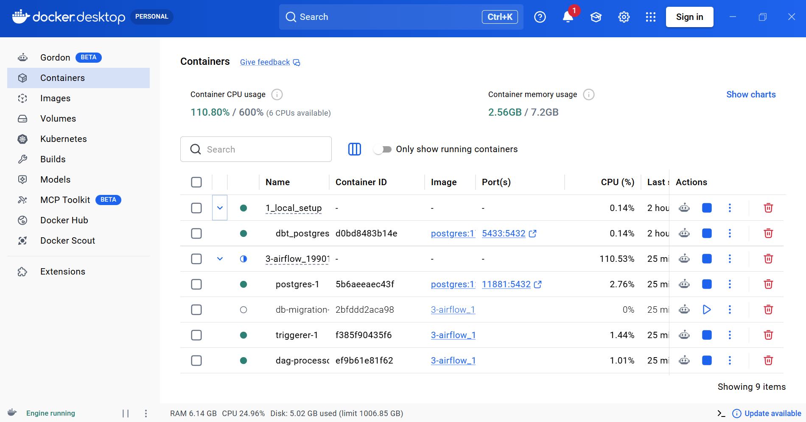
  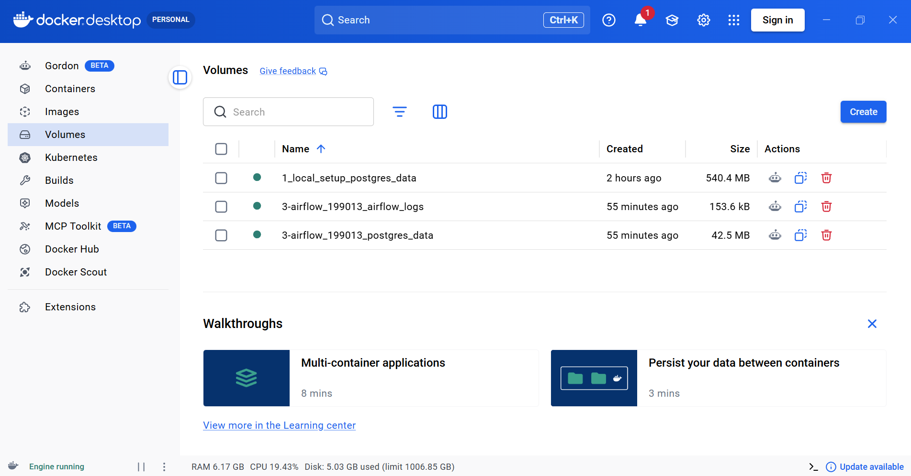
</p>

```bash
# Verifique se o container subiu:
docker ps
```

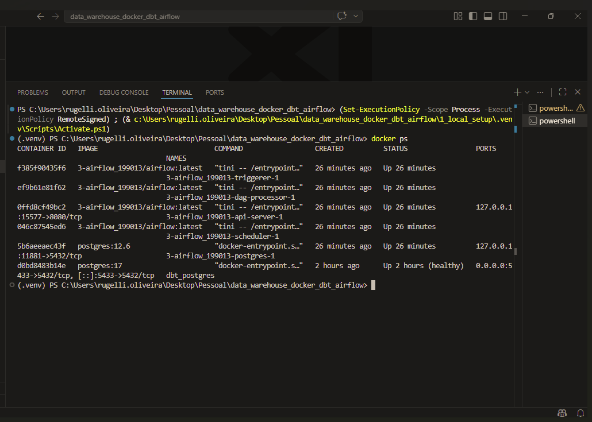

Você deve ver `dbt_postgres` com status `Up` e `(healthy)`.

> **Nota:** A porta usada é `5433` (não a padrão `5432`), para evitar conflito com outros serviços.

### Passo 5 — Crie o virtual environment Python

O `uv venv` cria um ambiente Python isolado dentro de `.venv/`:

```bash
# Ainda dentro de 1_local_setup/
uv venv .venv
```

Ative o virtual environment:

**Windows PowerShell:**
```powershell
.venv\Scripts\Activate.ps1
```

**Git Bash / Linux / Mac:**
```bash
source .venv/bin/activate
```

### Passo 6 — Instale as dependências Python

O `uv sync` lê o `pyproject.toml` e instala tudo de uma vez:

```bash
uv sync
```

O `pyproject.toml` declara as dependências do projeto:

```toml
# 1_local_setup/pyproject.toml
[project]
name = "1-local-setup"
version = "0.1.0"
requires-python = ">=3.11,<3.12"
dependencies = [
    "dbt-core>=1.10.15",       # Core do dbt
    "dbt-postgres>=1.9.1",     # Adaptador PostgreSQL para o dbt
    "duckdb>=1.4.3",           # Banco analítico local (opcional, para exploração)
    "faker>=38.2.0",           # Geração de dados fictícios
    "numpy>=2.3.5",
    "pandas>=2.3.3",
]
```

```bash
# Confirme que o dbt foi instalado:
dbt --version
```

---

## 7. Passo a Passo — Parte 2: Data Warehouse com dbt

> **Objetivo:** configurar o dbt, carregar os dados e executar todo o pipeline de transformação.

### Passo 7 — Configure o `profiles.yml`

O dbt precisa de um arquivo `profiles.yml` para saber como conectar ao banco. Este arquivo **não está no repositório** (boas práticas: contém credenciais).

Crie o arquivo em `2_data_warehouse/dw_bootcamp/profiles.yml`:

```yaml
# 2_data_warehouse/dw_bootcamp/profiles.yml
dw_bootcamp:          # Nome do perfil — deve ser igual ao campo "profile" do dbt_project.yml
  target: dev         # Target padrão usado quando você roda "dbt run"
  outputs:
    dev:
      type: postgres
      host: localhost
      port: 5433      # Porta que mapeamos no docker-compose
      user: postgres
      password: postgres
      dbname: dbt_db  # Banco criado pelo Docker
      schema: public
      threads: 4      # Paralelismo: quantos modelos rodam ao mesmo tempo
```

> **Importante:** o nome `dw_bootcamp` deve ser exatamente igual ao campo `profile` dentro do `dbt_project.yml`.

### Passo 8 — Entenda o `dbt_project.yml`

Este é o arquivo central de configuração do projeto dbt. Ele define nome, caminhos e comportamento de cada camada:

```yaml
# 2_data_warehouse/dw_bootcamp/dbt_project.yml
name: 'dw_bootcamp'   # Nome do projeto (deve bater com o profiles.yml)
version: '1.0.0'
profile: 'dw_bootcamp' # Perfil que o dbt vai buscar no profiles.yml

# Onde cada tipo de artefato está localizado
model-paths: ["models"]
seed-paths: ["seeds"]
test-paths: ["tests"]
macro-paths: ["macros"]

vars:
  "dbt_date:time_zone": "America/Sao_Paulo"  # Fuso horário para o pacote dbt-date

clean-targets:          # O que "dbt clean" remove
  - "target"            # Artefatos compilados
  - "dbt_packages"      # Pacotes instalados

models:
  dw_bootcamp:
    staging:
      +materialized: view    # Staging são views — baratas para recriar, sem custo de storage
    intermediate:
      +materialized: table   # Intermediate são tabelas — consultadas com frequência
    mart:
      +materialized: table   # Mart são tabelas — consumo direto por ferramentas de BI
```

### Passo 9 — Teste a conexão com o banco

```bash
cd 2_data_warehouse/dw_bootcamp
dbt debug
```

caso erro
```bash
@"
name: 'dw_bootcamp'
version: '1.0.0'
profile: 'dw_bootcamp'

model-paths: ["models"]
seed-paths: ["seeds"]
test-paths: ["tests"]
macro-paths: ["macros"]

vars:
  "dbt_date:time_zone": "America/Sao_Paulo"

clean-targets:
  - "target"
  - "dbt_packages"

models:
  dw_bootcamp:
    staging:
      +materialized: view
    intermediate:
      +materialized: table
    mart:
      +materialized: table
"@ | Set-Content -Path "dbt_project.yml" -Encoding UTF8NoBOM
```

O `dbt debug` verifica:
- Se o `profiles.yml` foi encontrado
- Se as credenciais estão corretas
- Se o banco está acessível

Todos os checks devem aparecer como `OK`. Se aparecer erro de conexão, verifique se o Docker está rodando e se o container `dbt_postgres` está `healthy`.

### Passo 10 — Instale os pacotes dbt

O arquivo `packages.yml` declara os pacotes externos que o projeto usa:

```yaml
# 2_data_warehouse/dw_bootcamp/packages.yml
packages:

  - package: dbt-labs/dbt_utils
    version: "1.3.0"
    # Macros utilitárias: surrogate_key, unpivot, date_spine, pivot, etc.
    # Essencial em projetos de Data Warehouse para padronizar lógica entre bancos.

  - package: metaplane/dbt_expectations
    version: "0.10.8"
    # Testes avançados de qualidade: ranges, nulls, valores aceitos, regras condicionais.
    # Mais expressivo que os testes nativos do dbt.
```

Instale os pacotes com:

```bash
dbt deps
```

### Passo 11 — Carregue os dados (dbt seed)

O `dbt seed` lê os arquivos CSV da pasta `seeds/` e os carrega no banco como tabelas:

```bash
dbt seed
```

Isso carrega `seeds/Airline_Delay_Cause.csv` (~41 MB, 318 mil linhas) no PostgreSQL. Pode demorar **alguns minutos** — é normal.

### Passo 12 — Execute o pipeline completo

```bash
dbt build
```

O `dbt build` executa em sequência:
1. **Seeds** — dados brutos
2. **Models** — todas as transformações (staging → intermediate → mart)
3. **Tests** — testes de qualidade de dados
4. **Snapshots** — capturas de estado (se existirem)

Nas próximas execuções, para pular o seed (que já foi carregado):

```bash
dbt build --exclude-resource-type seed
```

### Passo 13 — Execute apenas os models

Se preferir executar separadamente por etapa:

```bash
# Todos os models
dbt run

# Por camada
dbt run --select staging
dbt run --select intermediate
dbt run --select mart

# Um model específico
dbt run --select mart_airport_performance

# Um model e todos que dependem dele (downstream)
dbt run --select mart_airport_performance+
```

### Passo 14 — Visualize a documentação do dbt

O dbt gera documentação automática com lineage graph (grafo de dependências):

```bash
dbt docs generate   # Compila a documentação em HTML
dbt docs serve --port 8085  # Abre um servidor local
```

Acesse `http://localhost:8085` no navegador para ver o lineage graph completo do pipeline.

<p align="center">
  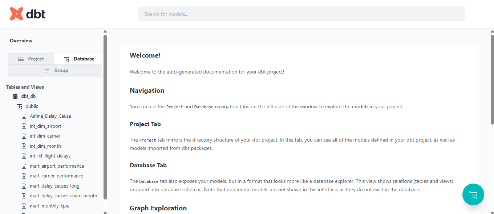
  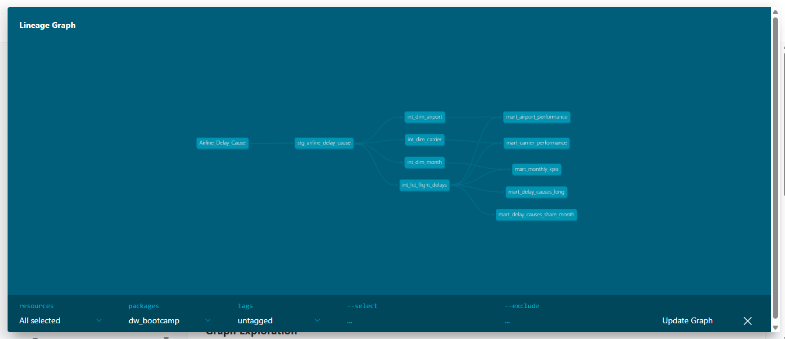
</p>

---

## 8. Passo a Passo — Parte 3: Orquestração com Airflow

> **Objetivo:** subir o Airflow com Astro CLI, conectar ao PostgreSQL e executar o pipeline automaticamente via DAG.

### Passo 15 — Entenda o Dockerfile do Airflow

O Airflow usa uma imagem base da Astronomer. Precisamos instalar o dbt **dentro de um virtualenv separado** no container para evitar conflitos de dependências:

```dockerfile
# 3_airflow/Dockerfile

# Imagem base oficial da Astronomer (Airflow 3.x)
FROM astrocrpublic.azurecr.io/runtime:3.1-8

# Cria um virtualenv isolado e instala o dbt-postgres dentro dele
# Esse venv fica em /usr/local/airflow/dbt_venv/
RUN python -m venv dbt_venv \
    && . dbt_venv/bin/activate \
    && pip install --no-cache-dir dbt-postgres==1.9.0 \
    && deactivate
# O "deactivate" sai do venv — o Airflow continua no Python principal
```

### Passo 16 — Entenda o `requirements.txt` do Airflow

```
# 3_airflow/requirements.txt
astronomer-cosmos              # Integração dbt + Airflow: converte projeto dbt em DAG automaticamente
apache-airflow-providers-postgres  # Operador e hook para conexões PostgreSQL no Airflow
```

### Passo 17 — Entenda o `docker-compose.override.yml`

Este arquivo estende o `docker-compose.yml` padrão do Astro CLI, montando o projeto dbt dentro dos containers que precisam dele:

```yaml
# 3_airflow/docker-compose.override.yml
# A porta do Postgres interno do Airflow é controlada pelo .astro/config.yaml
# (porta 5435) — não precisa declarar aqui para evitar mapeamento duplicado.

services:
  scheduler:
    volumes:
      # Monta a pasta dbt local dentro do container do scheduler
      # O scheduler lê o código do dbt para gerar as tasks do DAG
      - ./dbt/dw_bootcamp:/usr/local/airflow/dbt/dw_bootcamp

  dag-processor:
    volumes:
      # O dag-processor também precisa do projeto dbt para parsear o DAG
      - ./dbt/dw_bootcamp:/usr/local/airflow/dbt/dw_bootcamp
```

A porta do Postgres interno do Airflow é definida no `.astro/config.yaml`:

```yaml
# 3_airflow/.astro/config.yaml
project:
    name: 3-airflow
postgres:
    port: 5435   # Evita conflito com PostgreSQL instalado no Windows (5432)
                 # e com o dbt_postgres do módulo 1 (5433)
```

### Passo 18 — Certifique-se de que o projeto dbt está na pasta `dbt/`

O diretório `3_airflow/dbt/dw_bootcamp/` precisa ter uma cópia do projeto dbt.

```bash
# Verifique se já existe:
ls dbt/dw_bootcamp/
```

Se não existir, copie:

```bash
cp -r ../2_data_warehouse/dw_bootcamp dbt/
```

### Passo 19 — Suba o Airflow

```bash
cd 3_airflow
astro dev init
astro dev start
```

Esse comando vai:
1. Fazer o build da imagem Docker customizada (que inclui o dbt instalado)
2. Subir os containers do Airflow (webserver, scheduler, dag-processor, banco interno)

> Isso pode demorar alguns minutos na **primeira vez**, pois a imagem precisa ser construída.

Para reiniciar sem cache (quando mudar o `Dockerfile` ou `requirements.txt`):

```bash
astro dev stop
astro dev start --no-cache
```

### Passo 20 — Acesse a interface web do Airflow

Abra no navegador: `http://localhost:8080`

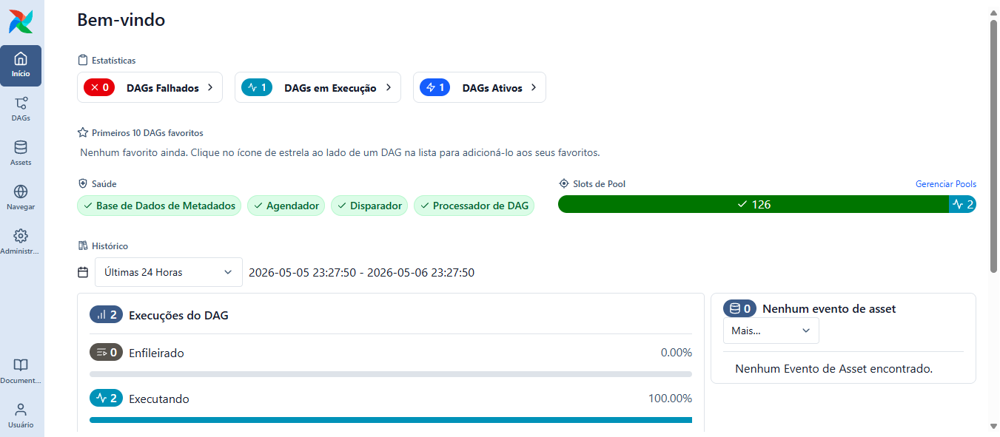

Credenciais padrão:
- **Usuário:** `admin`
- **Senha:** `admin`

### Passo 21 — Configure a conexão com o PostgreSQL

No Airflow, precisamos registrar a conexão com o banco para que o Cosmos possa injetá-la no dbt.

1. Vá em **Admin → Connections**
2. Clique em **+ (Add a new record)**
3. Preencha:

| Campo | Valor |
|---|---|
| Connection Id | `docker_postgres_db` |
| Connection Type | `Postgres` |
| Host | `host.docker.internal` |
| Schema | `dbt_db` |
| Login | `postgres` |
| Password | `postgres` |
| Port | `5433` |

4. Clique em **Save**

> `host.docker.internal` é o endereço que os containers Docker usam para acessar o `localhost` da sua máquina host.

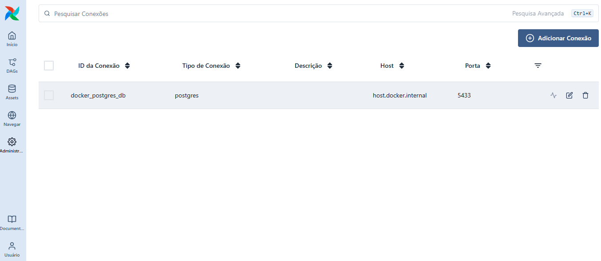

### Passo 22 — Configure a variável de ambiente do Airflow

A variável `dbt_env` controla qual perfil dbt será usado (dev ou prod) sem precisar mudar o código:

1. Vá em **Admin → Variables**
2. Clique em **+ (Add a new record)**
3. Preencha:

| Campo | Valor |
|---|---|
| Key | `dbt_env` |
| Val | `dev` |

4. Clique em **Save**

### Passo 23 — Entenda o DAG principal (`dag.py`)

Este é o DAG que integra o dbt ao Airflow usando a biblioteca Cosmos. Cada model dbt vira automaticamente uma task no Airflow:

```python
# 3_airflow/dags/dag.py

from airflow.models import Variable
from cosmos import DbtDag, ProjectConfig, ProfileConfig, ExecutionConfig
from cosmos.profiles import PostgresUserPasswordProfileMapping
import os
from pendulum import datetime


# ─────────────────────────────────────────────────────
# 1) PERFIL DEV — aponta para o PostgreSQL local (Docker)
# ─────────────────────────────────────────────────────
profile_config_dev = ProfileConfig(
    profile_name="dw_bootcamp",  # Mesmo nome do profiles.yml
    target_name="dev",
    profile_mapping=PostgresUserPasswordProfileMapping(
        # Conexão cadastrada em Admin → Connections no Airflow
        conn_id="docker_postgres_db",
        profile_args={"schema": "public"},
    ),
)

# ──────────────────────────────────────────────────────────
# 2) PERFIL PROD — aponta para o PostgreSQL remoto (Railway)
# ──────────────────────────────────────────────────────────
profile_config_prod = ProfileConfig(
    profile_name="dw_bootcamp",
    target_name="prod",
    profile_mapping=PostgresUserPasswordProfileMapping(
        conn_id="railway_postgres_db",  # Outra conexão, apontando para prod
        profile_args={"schema": "public"},
    ),
)

# ──────────────────────────────────────────────────────────────────
# 3) SELEÇÃO DO AMBIENTE — lido da variável "dbt_env" no Airflow UI
# ──────────────────────────────────────────────────────────────────
dbt_env = Variable.get("dbt_env", default_var="dev").lower()
# .lower() garante que "DEV", "Dev" e "dev" funcionam igual

if dbt_env not in ("dev", "prod"):
    raise ValueError(f"dbt_env inválido: {dbt_env!r}, use 'dev' ou 'prod'")

profile_config = profile_config_dev if dbt_env == "dev" else profile_config_prod

# ──────────────────────────────────────────────────────────────────
# 4) CRIAÇÃO DO DAG — o Cosmos lê o projeto dbt e gera as tasks
# ──────────────────────────────────────────────────────────────────
my_cosmos_dag = DbtDag(

    project_config=ProjectConfig(
        # Caminho do projeto dbt dentro do container (montado pelo docker-compose.override.yml)
        dbt_project_path="/usr/local/airflow/dbt/dw_bootcamp",
        project_name="dw_bootcamp",
    ),

    profile_config=profile_config,  # Credenciais injetadas via conexão do Airflow

    execution_config=ExecutionConfig(
        # Caminho do executável dbt dentro do virtualenv criado no Dockerfile
        dbt_executable_path=f"{os.environ['AIRFLOW_HOME']}/dbt_venv/bin/dbt",
    ),

    operator_args={
        "install_deps": True,  # Roda "dbt deps" antes de executar (baixa os pacotes)
        "target": profile_config.target_name,
    },

    schedule="@daily",                    # Execução diária automática
    start_date=datetime(2025, 12, 15),
    catchup=False,  # Não executa datas retroativas desde start_date

    dag_id=f"dag_dw_bootcamp_{dbt_env}",  # Nome do DAG muda conforme o ambiente
    default_args={"retries": 2},          # 2 tentativas em caso de falha
)
```

### Passo 24 — Ative e execute o DAG

1. Na tela principal do Airflow (DAGs), procure o DAG `dag_dw_bootcamp_dev`
2. Ative o toggle ao lado do nome
3. Clique no botão **▶ (Trigger DAG)** para executar manualmente
4. Acompanhe a execução clicando no DAG — cada model dbt aparece como uma task individual

Tarefas verdes = sucesso.

<p align="center">
  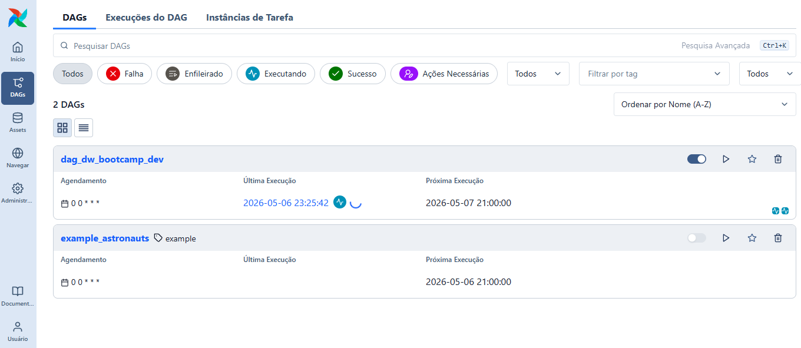
  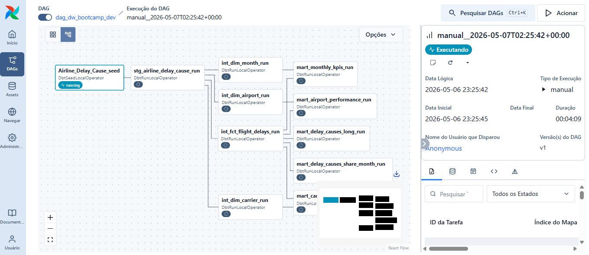
  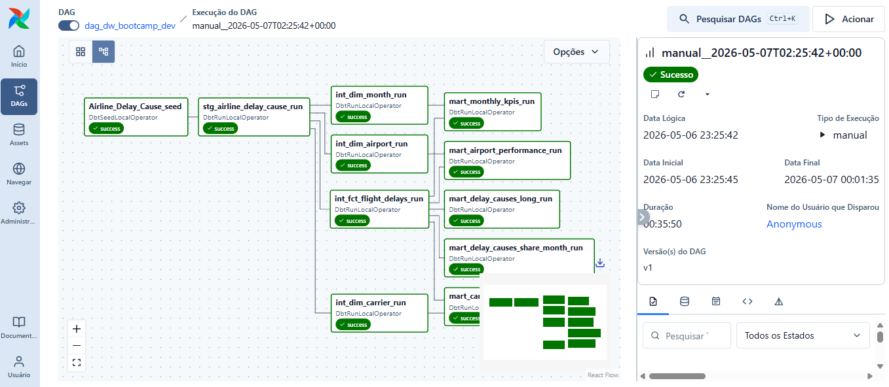
</p>


Para parar o Airflow:

```bash
astro dev stop
```

---

## 9. Modelos dbt em Detalhe

### Staging

#### `stg_airline_delay_cause`

**Materialização:** View — recriada a cada execução, sem custo de storage.

Este model lê o CSV carregado pelo seed, força os tipos corretos e cria a chave de tempo:

```sql
-- models/staging/stg_airline_delay_cause.sql

-- CTE "src": seleciona todas as colunas do seed (dados brutos)
with src as (
    select
        year, month,
        carrier, carrier_name,
        airport, airport_name,
        arr_flights, arr_del15,
        carrier_ct, weather_ct, nas_ct, security_ct, late_aircraft_ct,
        arr_cancelled, arr_diverted,
        arr_delay, carrier_delay, weather_delay,
        nas_delay, security_delay, late_aircraft_delay
    from {{ ref('Airline_Delay_Cause') }}
    -- {{ ref() }} é a forma do dbt referenciar outro model ou seed
    -- Cria a dependência automaticamente no lineage graph
),

-- CTE "typed": aplica cast de tipos e cria a chave de tempo
typed as (
    select
        cast(year  as integer) as year,
        cast(month as integer) as month,

        cast(carrier      as text) as carrier,
        cast(carrier_name as text) as carrier_name,
        cast(airport      as text) as airport,
        cast(airport_name as text) as airport_name,

        cast(arr_flights   as integer) as arr_flights,
        cast(arr_del15     as integer) as arr_del15,

        -- Contagens fracionais (um voo pode ser parcialmente atribuído a uma causa)
        cast(carrier_ct       as numeric) as carrier_ct,
        cast(weather_ct       as numeric) as weather_ct,
        cast(nas_ct           as numeric) as nas_ct,
        cast(security_ct      as numeric) as security_ct,
        cast(late_aircraft_ct as numeric) as late_aircraft_ct,

        cast(arr_cancelled as integer) as arr_cancelled,
        cast(arr_diverted  as integer) as arr_diverted,

        cast(arr_delay           as integer) as arr_delay,
        cast(carrier_delay       as integer) as carrier_delay,
        cast(weather_delay       as integer) as weather_delay,
        cast(nas_delay           as integer) as nas_delay,
        cast(security_delay      as integer) as security_delay,
        cast(late_aircraft_delay as integer) as late_aircraft_delay,

        -- Chave de tempo: year * 100 + month → ex: 2022*100 + 5 = 202205
        -- Permite ordenar cronologicamente com um simples ORDER BY
        (cast(year as integer) * 100 + cast(month as integer)) as year_month_key

    from src
)

select * from typed
```

---

### Intermediate — Dimensões

#### `int_dim_airport`

**Materialização:** Table — deduplica aeroportos para criar a dimensão limpa.

```sql
-- models/intermediate/int_dim_airport.sql

with base as (
    select
        airport,
        airport_name
    from {{ ref('stg_airline_delay_cause') }}
    -- Referencia o staging — o dbt garante que o staging roda primeiro
)

select
    airport           as airport_id,   -- Código IATA (ex: ATL, LAX)
    max(airport_name) as airport_name  -- max() desambigua linhas duplicadas com nomes ligeiramente diferentes
from base
group by airport  -- Cada aeroporto aparece uma única vez
```

#### `int_dim_carrier`

**Materialização:** Table — mesma lógica, para companhias aéreas.

```sql
-- models/intermediate/int_dim_carrier.sql

with base as (
    select
        carrier,
        carrier_name
    from {{ ref('stg_airline_delay_cause') }}
)

select
    carrier           as carrier_id,   -- Código da companhia (ex: AA, DL, UA)
    max(carrier_name) as carrier_name  -- Nome completo (ex: American Airlines)
from base
group by carrier
```

#### `int_dim_month`

**Materialização:** Table — dimensão de tempo com ano e mês separados.

```sql
-- models/intermediate/int_dim_month.sql

with base as (
    select distinct          -- distinct: cada combinação única de ano+mês
        year,
        month,
        year_month_key       -- Chave criada no staging (ex: 202205)
    from {{ ref('stg_airline_delay_cause') }}
)

select
    year_month_key as month_id,  -- Chave primária da dimensão de tempo
    year,
    month
from base
```

---

### Intermediate — Fato

#### `int_fct_flight_delays`

**Materialização:** Table — tabela fato central do Star Schema. Cada linha = 1 combinação de (mês + companhia + aeroporto).

```sql
-- models/intermediate/int_fct_flight_delays.sql

with stg as (
    select * from {{ ref('stg_airline_delay_cause') }}
),

fct as (
    select
        -- Chaves estrangeiras que ligam às dimensões
        stg.year_month_key as month_id,    -- FK → int_dim_month
        stg.carrier        as carrier_id,  -- FK → int_dim_carrier
        stg.airport        as airport_id,  -- FK → int_dim_airport

        -- Métricas de volume de voos
        stg.arr_flights,    -- Total de voos que chegaram
        stg.arr_del15,      -- Voos atrasados 15+ minutos
        stg.arr_cancelled,  -- Voos cancelados
        stg.arr_diverted,   -- Voos desviados

        -- Minutos totais de atraso por causa
        stg.arr_delay,             -- Atraso total
        stg.carrier_delay,         -- Culpa da companhia (manutenção, tripulação)
        stg.weather_delay,         -- Condições climáticas
        stg.nas_delay,             -- Sistema aéreo nacional (controle de tráfego)
        stg.security_delay,        -- Segurança/triagem
        stg.late_aircraft_delay,   -- Aeronave atrasada de voo anterior

        -- Contagem de ocorrências por causa (fracionais)
        stg.carrier_ct,
        stg.weather_ct,
        stg.nas_ct,
        stg.security_ct,
        stg.late_aircraft_ct

    from stg
)

select * from fct
```

---

### Mart — Tabelas Analíticas

#### `mart_airport_performance`

Agrega todas as métricas por aeroporto — ideal para rankings e comparações.

```sql
-- models/mart/mart_airport_performance.sql

with fct as (
    select * from {{ ref('int_fct_flight_delays') }}
),
dim_airport as (
    select * from {{ ref('int_dim_airport') }}
)

select
    a.airport_id,
    a.airport_name,

    sum(f.arr_flights)   as flights,          -- Total de voos no período
    sum(f.arr_del15)     as delayed_15m,       -- Voos com 15+ min de atraso

    -- Percentual de atraso: se total = 0, retorna 0 (evita divisão por zero)
    case when sum(f.arr_flights) = 0 then 0
         else 1.0 * sum(f.arr_del15) / sum(f.arr_flights)
    end                  as pct_delayed_15m,

    sum(f.arr_cancelled) as cancelled,
    sum(f.arr_delay)     as total_delay_minutes

from fct f
join dim_airport a on f.airport_id = a.airport_id
group by 1, 2  -- Agrupa por airport_id e airport_name
```

#### `mart_carrier_performance`

Mesma lógica do anterior, agora agrupada por companhia aérea.

```sql
-- models/mart/mart_carrier_performance.sql

with fct as (
    select * from {{ ref('int_fct_flight_delays') }}
),
dim_carrier as (
    select * from {{ ref('int_dim_carrier') }}
)

select
    c.carrier_id,
    c.carrier_name,

    sum(f.arr_flights)   as flights,
    sum(f.arr_del15)     as delayed_15m,

    case when sum(f.arr_flights) = 0 then 0
         else 1.0 * sum(f.arr_del15) / sum(f.arr_flights)
    end                  as pct_delayed_15m,

    sum(f.arr_cancelled) as cancelled,
    sum(f.arr_delay)     as total_delay_minutes

from fct f
join dim_carrier c on f.carrier_id = c.carrier_id
group by 1, 2
```

#### `mart_monthly_kpis`

Série temporal com KPIs mensais — ideal para gráficos de linha ao longo do tempo.

```sql
-- models/mart/mart_monthly_kpis.sql

with fct as (
    select * from {{ ref('int_fct_flight_delays') }}
),
dim_month as (
    select * from {{ ref('int_dim_month') }}
)

select
    m.year,
    m.month,
    m.month_id,   -- Chave para ordenação (ex: 202205)

    sum(f.arr_flights) as flights,
    sum(f.arr_del15)   as delayed_15m,

    case when sum(f.arr_flights) = 0 then 0
         else 1.0 * sum(f.arr_del15) / sum(f.arr_flights)
    end                as pct_delayed_15m,

    sum(f.arr_cancelled) as cancelled,
    sum(f.arr_diverted)  as diverted,
    sum(f.arr_delay)     as total_delay_minutes

from fct f
join dim_month m on f.month_id = m.month_id
group by 1, 2, 3
```

#### `mart_delay_causes_long`

Converte as colunas de causa em linhas (**unpivot**) — formato ideal para gráficos de barras empilhadas e filtros por causa.

```sql
-- models/mart/mart_delay_causes_long.sql

with fct as (
    select * from {{ ref('int_fct_flight_delays') }}
),

-- Técnica de unpivot manual via UNION ALL:
-- cada bloco SELECT transforma uma coluna em uma linha com label "cause"
unpivoted as (
    select month_id, carrier_id, airport_id, 'carrier'       as cause, carrier_delay       as delay_minutes from fct
    union all
    select month_id, carrier_id, airport_id, 'weather'       as cause, weather_delay       as delay_minutes from fct
    union all
    select month_id, carrier_id, airport_id, 'nas'           as cause, nas_delay           as delay_minutes from fct
    union all
    select month_id, carrier_id, airport_id, 'security'      as cause, security_delay      as delay_minutes from fct
    union all
    select month_id, carrier_id, airport_id, 'late_aircraft' as cause, late_aircraft_delay as delay_minutes from fct
)

select * from unpivoted
-- Resultado: 5x mais linhas que a fato, mas com coluna "cause" filtrável
```

#### `mart_delay_causes_share_month`

Percentual de participação de cada causa por mês — útil para análise de tendência.

```sql
-- models/mart/mart_delay_causes_share_month.sql

with fct as (
    select * from {{ ref('int_fct_flight_delays') }}
),

-- Agrega por mês para calcular o total e o subtotal de cada causa
by_month as (
    select
        month_id,
        sum(arr_delay)           as total_delay,
        sum(carrier_delay)       as carrier_delay,
        sum(weather_delay)       as weather_delay,
        sum(nas_delay)           as nas_delay,
        sum(security_delay)      as security_delay,
        sum(late_aircraft_delay) as late_aircraft_delay
    from fct
    group by 1
)

select
    month_id,
    total_delay,

    -- Percentual de cada causa sobre o total do mês
    -- CASE protege contra divisão por zero em meses sem dados
    case when total_delay = 0 then 0 else 1.0 * carrier_delay       / total_delay end as pct_carrier,
    case when total_delay = 0 then 0 else 1.0 * weather_delay       / total_delay end as pct_weather,
    case when total_delay = 0 then 0 else 1.0 * nas_delay           / total_delay end as pct_nas,
    case when total_delay = 0 then 0 else 1.0 * security_delay      / total_delay end as pct_security,
    case when total_delay = 0 then 0 else 1.0 * late_aircraft_delay / total_delay end as pct_late_aircraft

from by_month
```

---

## 10. Configurações Importantes

### Ports utilizadas

| Serviço | Porta | Observação |
|---|---|---|
| PostgreSQL (local) | `5433` | Banco do dbt (docker-compose do módulo 1) |
| PostgreSQL (Airflow metadata) | `5435` | Banco interno do Airflow (metadados) |
| PostgreSQL Windows (serviço local) | `5432` | Instalação nativa do Windows — não usada pelo projeto |
| Airflow Webserver | `8080` | Interface web |
| dbt docs | `8085` | Documentação do dbt |

### Variáveis de ambiente (`.env`)

```env
DBT_USER=postgres
DBT_PASSWORD=postgres
```

### Configuração de materialização (`dbt_project.yml`)

```yaml
models:
  dw_bootcamp:
    staging:
      +materialized: view      # Views: sem custo de storage, sempre atualizadas
    intermediate:
      +materialized: table     # Tabelas: melhor performance para joins
    mart:
      +materialized: table     # Tabelas: consumo direto por BI
```

---

## 11. Erros Comuns e Soluções

### "Connection refused" no `dbt debug`

**Causa:** Docker não está rodando ou o container não subiu.

```bash
# Verifique se o Docker Desktop está aberto, depois:
docker ps
# Se o container não aparecer:
cd 1_local_setup
docker compose up -d
```

### "Profile not found" no `dbt debug`

**Causa:** O arquivo `profiles.yml` não existe ou está no local errado.

**Solução:** Crie o arquivo em `2_data_warehouse/dw_bootcamp/profiles.yml` conforme descrito no Passo 7. Verifique se o nome do perfil é exatamente `dw_bootcamp`.

### `dbt seed` demora muito

**Causa:** O arquivo CSV tem 41 MB e 318k linhas — é normal demorar alguns minutos.

**Solução:** Aguarde. Você pode monitorar o progresso nos logs do terminal.

### Erro no Airflow: "Can't connect to host.docker.internal"

**Causa:** No Linux, `host.docker.internal` pode não funcionar automaticamente.

**Solução:** Adicione ao `docker-compose.override.yml`:

```yaml
services:
  scheduler:
    extra_hosts:
      - "host.docker.internal:host-gateway"
```

### DAG não aparece no Airflow

**Causa:** Erro de sintaxe no DAG ou o Airflow ainda está indexando.

```bash
# Verifique os logs do scheduler para encontrar o erro:
astro dev logs scheduler
```

### `astro dev start` falha por porta em uso

**Causa mais comum no Windows:** o PostgreSQL está instalado como serviço do Windows e ocupa a porta `5432`, que o Airflow tenta usar para seu banco interno de metadados.

**Solução aplicada neste projeto:** o `.astro/config.yaml` e o `docker-compose.override.yml` já estão configurados para usar a porta `5435` em vez de `5432`. Se ainda assim falhar, rode com `--no-cache`:

```bash
astro dev stop
astro dev start --no-cache
```

**Se o erro for na porta `8080`** (Airflow webserver), descubra o processo conflitante:

```bash
# Windows PowerShell:
netstat -ano | findstr :8080
```
---

## 12. Resultado final (data warehouse)

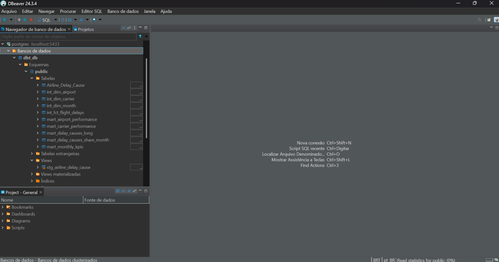

---

## 13. Comandos de Referência Rápida

### Docker

```bash
# Subir PostgreSQL local
docker compose up -d

# Parar PostgreSQL local
docker compose down

# Ver containers rodando
docker ps

# Ver logs do PostgreSQL
docker logs dbt_postgres
```

### dbt

```bash
# Testar conexão
dbt debug

# Instalar pacotes
dbt deps

# Carregar dados seed
dbt seed

# Executar todos os models
dbt run

# Executar seeds + models + tests
dbt build

# Executar models ignorando seeds
dbt build --exclude-resource-type seed

# Executar model específico
dbt run --select nome_do_model

# Executar camada específica
dbt run --select staging
dbt run --select intermediate
dbt run --select mart

# Executar model e todos que dependem dele
dbt run --select nome_do_model+

# Gerar documentação
dbt docs generate

# Servir documentação
dbt docs serve --port 8085

# Ver logs detalhados
dbt run --debug
```

### Airflow (Astro CLI)

```bash
# Subir Airflow
astro dev init
astro dev start

# Parar Airflow
astro dev stop

# Reiniciar sem cache (após mudar Dockerfile ou requirements.txt)
astro dev stop
astro dev start --no-cache

# Ver logs
astro dev logs

# Ver logs do scheduler
astro dev logs scheduler

# Ver logs do webserver
astro dev logs webserver
```

---

## 14. CI/CD com GitHub Actions

### O que é CI/CD?

**CI (Continuous Integration)** significa que toda vez que você faz um `git push` ou abre um Pull Request, o GitHub executa automaticamente uma série de verificações. Se algo estiver errado (SQL inválido, model com erro), o CI **reprovará** antes do código chegar na branch principal.

**Neste projeto**, o CI garante que:
- Todos os modelos dbt compilam (sintaxe SQL correta)
- O pipeline completo executa sem erros contra um banco PostgreSQL real
- Os artefatos de documentação são gerados e salvos

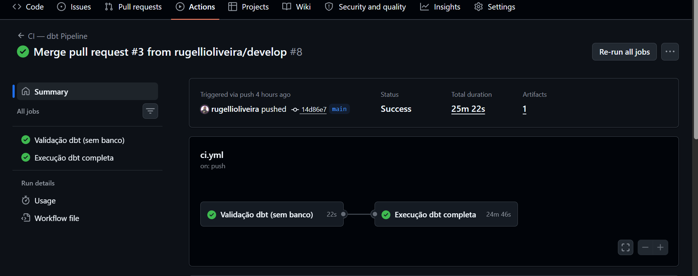

### Como o workflow está organizado

```
Push / Pull Request
        │
        ▼
┌─────────────────────────┐
│ Job 1: dbt-compile      │  ← Valida sintaxe SQL (~2 min, sem banco)
│  • dbt deps             │
│  • dbt parse            │
└────────────┬────────────┘
             │ (só continua se passar)
             ▼
┌─────────────────────────────────────────────┐
│ Job 2: dbt-build                            │  ← Pipeline completo (~10-15 min)
│  • Sobe PostgreSQL 17 como serviço Docker   │
│  • dbt debug  → testa a conexão             │
│  • dbt seed   → carrega o CSV               │
│  • dbt build  → models + testes             │
│  • dbt docs generate → gera documentação    │
│  • Upload dos docs como artefato            │
└─────────────────────────────────────────────┘
```

### Entenda o arquivo `.github/workflows/ci.yml`

```yaml
name: CI — dbt Pipeline

on:
  push:
    branches: [main, develop]
  pull_request:
    branches: [main, develop]

jobs:
  dbt-compile:
    name: Validação dbt (sem banco)
    runs-on: ubuntu-latest

    steps:
      # Faz checkout do código do repositório
      - name: Checkout
        uses: actions/checkout@v4

      # Configura ambiente Python 3.11
      - name: Python
        uses: actions/setup-python@v5
        with:
          python-version: "3.11"

      # Instala adaptador dbt para PostgreSQL
      - name: Instalar dbt-postgres
        run: pip install dbt-postgres

      # Cria arquivo profiles.yml temporário para execução no CI
      - name: profiles.yml (CI)
        run: |
          mkdir -p ~/.dbt
          cat > ~/.dbt/profiles.yml << 'EOF'
          dw_bootcamp:
            target: dev
            outputs:
              dev:
                type: postgres
                host: localhost
                port: 5432
                user: postgres
                password: postgres
                dbname: dbt_db
                schema: public
                threads: 4
          EOF

      # Instala dependências declaradas no packages.yml
      - name: dbt deps (compile)
        working-directory: 2_data_warehouse/dw_bootcamp
        run: dbt deps --profiles-dir ~/.dbt

      # Faz parsing dos modelos para validar sintaxe e estrutura
      - name: dbt parse
        working-directory: 2_data_warehouse/dw_bootcamp
        run: dbt parse --profiles-dir ~/.dbt


  dbt-build:
    name: Execução dbt completa
    runs-on: ubuntu-latest
    needs: dbt-compile

    services:
      # Serviço PostgreSQL utilizado durante os testes do pipeline
      postgres:
        image: postgres:17
        env:
          POSTGRES_USER: postgres
          POSTGRES_PASSWORD: postgres
          POSTGRES_DB: dbt_db
        ports:
          - 5432:5432
        options: >-
          --health-cmd "pg_isready -U postgres"
          --health-interval 5s
          --health-timeout 5s
          --health-retries 10

    steps:
      # Faz checkout do código do repositório
      - name: Checkout
        uses: actions/checkout@v4

      # Configura ambiente Python 3.11
      - name: Python
        uses: actions/setup-python@v5
        with:
          python-version: "3.11"

      # Instala adaptador dbt para PostgreSQL
      - name: Instalar dbt-postgres
        run: pip install dbt-postgres

      # Cria arquivo profiles.yml apontando para PostgreSQL do CI
      - name: profiles.yml (CI)
        run: |
          mkdir -p ~/.dbt
          cat > ~/.dbt/profiles.yml << 'EOF'
          dw_bootcamp:
            target: dev
            outputs:
              dev:
                type: postgres
                host: localhost
                port: 5432
                user: postgres
                password: postgres
                dbname: dbt_db
                schema: public
                threads: 4
          EOF

      # Instala dependências do projeto dbt
      - name: dbt deps
        working-directory: 2_data_warehouse/dw_bootcamp
        run: dbt deps --profiles-dir ~/.dbt

      # Valida conexão entre dbt e PostgreSQL
      - name: dbt debug
        working-directory: 2_data_warehouse/dw_bootcamp
        run: dbt debug --profiles-dir ~/.dbt

      # Carrega arquivos CSV definidos em seeds/
      - name: dbt seed
        working-directory: 2_data_warehouse/dw_bootcamp
        run: dbt seed --profiles-dir ~/.dbt

      # Executa modelos e testes do projeto
      - name: dbt build
        working-directory: 2_data_warehouse/dw_bootcamp
        run: dbt build --exclude-resource-type seed --profiles-dir ~/.dbt

      # Gera documentação estática do dbt
      - name: dbt docs generate
        working-directory: 2_data_warehouse/dw_bootcamp
        run: dbt docs generate --profiles-dir ~/.dbt

      # Publica artefatos gerados da documentação
      - name: Upload docs
        uses: actions/upload-artifact@v4
        with:
          name: dbt-docs
          path: 2_data_warehouse/dw_bootcamp/target/
          retention-days: 7
```

### Passo 25 — Publique o projeto no GitHub

Para o CI funcionar, o projeto precisa estar em um repositório no GitHub.

#### 25.1 — Crie um repositório no GitHub

1. Acesse [github.com](https://github.com) e faça login
2. Clique em **New repository** (botão verde)
3. Dê um nome (ex: `projeto-dw`)
4. Deixe como **Public** (ou Private — funciona nos dois)
5. **Não** marque "Add a README" (o projeto já tem um)
6. Clique em **Create repository**

#### 25.2 — Conecte seu projeto local ao repositório remoto

```bash
# Dentro da pasta projeto_final_engenharia:

# Se ainda não inicializou o git:
git init
git add .
git commit -m "feat: projeto inicial"

# Conecte ao repositório remoto (substitua pela sua URL):
git remote add origin https://github.com/SEU_USUARIO/SEU_REPOSITORIO.git

# Envie para o GitHub:
git branch -M main
git push -u origin main
```

> **Atenção:** o `profiles.yml` está no `.gitignore` — nunca suba credenciais para o GitHub.

### Passo 26 — Acompanhe o CI na aba Actions

Após o `git push`:

1. Acesse seu repositório no GitHub
2. Clique na aba **Actions** (menu superior)
3. Você verá o workflow **"CI — dbt Pipeline"** rodando
4. Clique nele para ver os logs em tempo real

Se tudo estiver correto, verá dois checkmarks verdes:

```
✅ Compilar modelos dbt (validação de sintaxe)
✅ Executar pipeline completo (seed + run + test)
```

Se houver erro em algum modelo SQL, você verá um ❌ com o log apontando o arquivo e a linha exata do problema.

### Passo 27 — Baixe os artefatos de documentação

Após o Job 2 passar com sucesso:

1. Na tela do workflow concluído, role até o final
2. Na seção **Artifacts**, clique em **dbt-docs**
3. Um `.zip` será baixado com a documentação gerada
4. Extraia e abra o `index.html` no navegador para ver o lineage graph

### Passo 28 — Testando o CI com um Pull Request (fluxo de equipe)

```bash
# Crie uma nova branch para uma alteração:
git checkout -b feature/minha-alteracao

# Faça alguma mudança (ex: adicione uma coluna em um mart)
# Depois:
git add .
git commit -m "feat: adiciona coluna X no mart_airport_performance"
git push origin feature/minha-alteracao
```

No GitHub, abra um **Pull Request** da sua branch para `main`. O CI rodará automaticamente. Só faça o merge quando os dois jobs passarem — esse é o fluxo profissional de trabalho em equipe.

### Erros comuns no CI

#### Workflow não aparece na aba Actions

```bash
# Verifique se o arquivo foi commitado:
git status
git add .github/workflows/ci.yml
git commit -m "ci: adiciona workflow do GitHub Actions"
git push
```

#### Job 1 falha em `dbt parse`

**Causa:** Erro de sintaxe em um modelo SQL (referência inválida, `{{ ref() }}` errado, YAML malformado).

**Solução:** Leia o log de erro na aba Actions — ele mostra o arquivo e a linha exata. Corrija localmente, commit e push.

#### Job 2 demora mais de 20 minutos

**Causa:** Instabilidade no runner do GitHub (raro).

**Solução:** Reexecute clicando em **Re-run jobs** na aba Actions.

---

## Referências

- [Documentação oficial do dbt](https://docs.getdbt.com)
- [dbt-utils](https://hub.getdbt.com/dbt-labs/dbt_utils/latest/)
- [dbt-expectations](https://hub.getdbt.com/calogica/dbt_expectations/latest/)
- [astronomer-cosmos](https://astronomer.github.io/astronomer-cosmos/)
- [Astro CLI](https://docs.astronomer.io/astro/cli/overview)
- [Docker Compose](https://docs.docker.com/compose/)
- [GitHub Actions — Documentação oficial](https://docs.github.com/en/actions)

---

*Documentação gerada em 2026-05-07*
